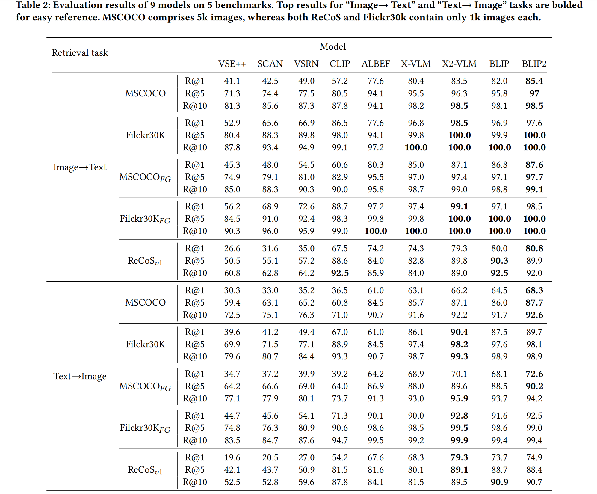

# ReCoS Benchmark
**ReCoS: A Novel Benchmark for Cross-Modal Image-Text Retrieval in Complex Real-Life Scenarios**  
Xiaojun Chen, Jimeng Lou, Wenxi Huang, Ting Wan, Qin Zhang, Min Yang.  
In Proceedings of the 32nd ACM International Conference on Multimedia (MM ’24), October 28-November 1, 2024, Melbourne, VIC, Australia. 

## Abstract

    Image-text retrieval stands as a pivotal task within information retrieval, gaining increasing importance with the rapid advancements in Visual-Language Pretraining models. 
    However, current benchmarks for evaluating these models face limitations, exemplified by instances such as BLIP2 achieving near-perfect performance on existing benchmarks. 
    In response, this paper advocates for a more robust evaluation benchmark for image-text retrieval, one that embraces several essential characteristics. Firstly, a comprehensive 
    benchmark should cover a diverse range of tasks in both perception and cognition-based retrieval. Recognizing this need, we introduce $ReCoS$, a novel benchmark specifically 
    designed for cross-modal image-text retrieval in complex real-life scenarios. Unlike existing benchmarks, $ReCoS$ encompasses 12 retrieval tasks, with a particular focus on 
    three cognition-based tasks, providing a more holistic assessment of model capabilities. To ensure the novelty of the benchmark, we emphasize the use of original data sources, 
    steering clear of reliance on existing publicly available datasets to minimize the risk of data leakage. Additionally, to strike a balance between the complexity of the real world 
    and benchmark usability, $ReCoS$ includes text descriptions that are neither overly detailed, making retrieval overly simplistic, nor under-detailed to the point where retrieval becomes impossible. 
    Our evaluation results shed light on the challenges faced by existing methods, especially in cognition-based retrieval tasks within $ReCoS$. This underscores the necessity for innovative approaches 
    in addressing the complexities of image-text retrieval in real-world scenarios.

## Features
We posit that a comprehensive evaluation benchmark for image-text retrieval tasks should exhibit the following four characteristics:
- **Comprehensive Coverage:** Encompassing frequently encountered perception-based retrieval tasks as well as more challenging cognition-based retrieval tasks.
- **Original Data Sources:** Avoiding reliance on existing publicly available datasets to minimize the risk of data leakage and ensure the novelty of the benchmark.
- **Balanced Text Descriptions:** Striking a balance in text descriptions involves avoiding under-detailing to the point where retrieval becomes impossible, while also steering clear of excessive detail that renders retrieval overly simplistic.
- **Alignment with Real-World Complexity:** Reflecting the intricacies of real-world scenarios to accurately assess the capabilities of Visual-Language Pretraining models in diverse and challenging environments.

## Benchmark

    In this section, we present the details of our new benchmark. 
    We initiated the process by collecting a set of 500 images designed to address 12 types of retrieval tasks, 
    encompassing complex real-life scenarios. Building upon this original dataset, we generated three versions 
    of the benchmark. The first version, $ReCoS_{v0}$, consists of 500 image-text pairs. 
    We then extended this set to create $ReCoS_{v1}$, which includes an additional 500 similar image-text pairs 
    to $ReCoS_{v0}$ to increase task difficulty. Finally, $ReCoS_{v2}$ was formed by introducing 1940 additional 
    pure images similar to the images in $ReCoS_{v0}$ to $ReCoS_{v1}$ to further increase task difficulty. 
    The subsequent section provides a detailed account of the benchmark construction process.

    

    

## Examples

    Illustrated in Figure6 is an example from our benchmark, beginning with an image featuring four elephants.
    The annotation process involves associating the image with five diverse text descriptions. 
    Subsequently, to augment task difficulty, we introduce image confusion by incorporating an image depicting five elephants. 
    Lastly, we engage in image expansion by introducing four additional images, each portraying a different number of elephants. 
    This multi-step process not only enriches the benchmark's complexity but also offers a dynamic representation of the challenges 
    inherent in image-text retrieval tasks within our dataset.

    

## Experiments
We evaluated several representative image-text retrieval models on our new benchmarks 
and further analyzed their capabilities in complex real-life scenarios

## Download

[Download the ReCoS Benchmark](https://drive.google.com/drive/folders/1TIleVTV5cx_aaitabiQ0Wbvq-huxN6Gu?usp=sharing)

### Images

We provide text descriptions and a portion of images for the Rescos dataset in both $ReCoS_{v1}$ and $ReCoS_{v2}$ versions. 
These images include four categories manually created: text translation, code reasoning, numerical calculation,
and celebrity. For the other eight categories, due to copyright restrictions, we only provide the official 
download links and image names, and authors are required to download them independently. Notably, images for the seven 
coarse-grained perceptual categories are sourced from the publicly available COCO dataset, while images for 
the OCR category are from the Totaltext public dataset.

See `images` for more details. If you wish to evaluate your model on our new benchmarks, you can turn to the offical website of [COCO](https://cocodataset.org) and [TotalText](https://github.com/cs-chan/Total-Text-Dataset) to download the corresponding images.

### Text Annotations
See `recos_v1.json` for more details.

## Citation
If you find this code useful for your research, please consider citing:

